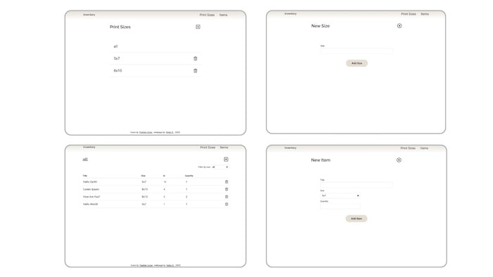

# The Odin Project: Inventory Application

 
  

      
  

 

 

This **Inventory Application** project was developed to demonstrate my understanding of data management based on **CRUD model**, and creating backend application using **Express**, **EJS**, **PostgreSQL**.

For more details on the project assignment, please visit [The Odin Project - Inventory Application](https://www.theodinproject.com/lessons/node-path-nodejs-inventory-application).

## Key Project Instructions

The project was developed following these main guidelines:

- Brainstorm the structure of the database tables and fields, and relations with each data for the inventory management.

- The subject of inventory can be anything. => I chose to create art print shop inventory app.

- Set up routes, controllers, views folders.

- Make all the forms for create and update the inventory.

- Develop the controllers that manages inventory data.

- Add delete function.

- Using a new local PostgreSQL database test the application by adding fake data.

- Deploy the app.

### Extra credit challenge

**UI design:**   Make the UI look good.

**Password confirmation:**   Add password entry feature to confirm before deleting / updating the data using the current knowledge (before learning Authentication).

## Built With

- CSS
- JavaScript
- Express
- EJS
- PostgreSQL
- Dotenv
- ESLint
- Prettier
